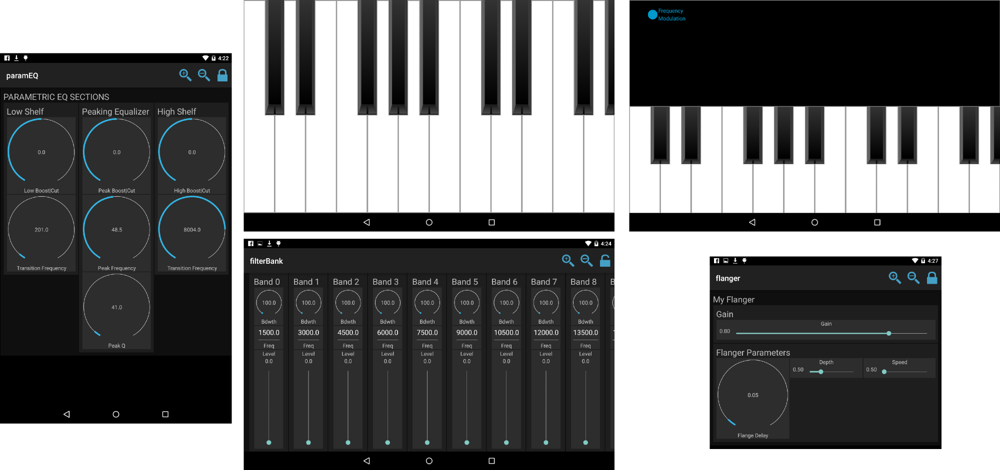

# Faust2android

`faust2android` is a tool to convert a Faust code into a fully functional Android application. It is part of the [Faust distribution](https://github.com/grame-cncm/faust) and it is based on [`faust2api`](https://ccrma.stanford.edu/~rmichon/faust2api).

This documentation shows how to install and use this tool.

## Installing and Using `faust2android` 

Although `faust2android` can be used directly on your computer, it might be easier to compile your apps using the [Faust Online Compiler](http://faust.grame.fr/onlinecompiler/). Indeed, `faust2android` relies on an important number of dependencies that you might not want to install on your system. If you're brave enough for this, read the following instructions!

**Note:** `faust2android` will only work on Linux and OSX. If you use Windows, use the [Online Compiler](http://faust.grame.fr/onlinecompiler/).

Installation instructions should be the same for Linux and OSX.

First, Faust (0 or 2) must be installed on your system. If it's not already the case, read the [Faust README](https://github.com/grame-cncm/faust/blob/master/README.md) to learn how to do this.

Next, [Download Android Studio](https://developer.android.com/studio/index.html) and extract it somewhere on your computer. We recommend creating an `/Android` folder in your home directory and place `android-studio` in it.

Add `android-studio/bin` to your path, e.g.:

	export PATH=$PATH:/home/you/Android/android-studio/bin
	
Now you should be able to run Android Studio from your terminal simply by calling:

	studio.sh
	
In Android Studio, in `Tools/Android/SDK Manager`, make sure that you have the latest SDK installed (Android 7.1.1 as of Dec. 8, 2016). Next click on the "SDK Tools" tab and install `CMake` and the `NDK`. Android Studio should automatically create an `/Sdk` folder in your `/Android` folder (`/Android/Sdk`)

Create dynamic links to `/Android/Sdk/ndk-bundle` and `/Android/Sdk` as follow:

	ln -s ~/Android/Sdk/ndk-bundle ndk
	ln -s ~/Android/Sdk sdk
	
This is very important since `faust2android` will be looking for these folder. Alternatively, you could modify the source code of `faust2android` to make sure that it's looking in the right folder but that's a more complicated option...

On Linux, make sure that JAVA is properly installed on your system. At the very least, the following packages should be installed:

	openjdk-8-jdk
	openjdk-8-jdk-headless
	openjdk-8-jdk-jre
	openjdk-8-jre-headless

We noticed some issues with `openjdk-9` when compiling Android apps from the terminal which is why we suggest you to install version 8 here. Although you might want to give a try to version 9: it's up to you!

Finally, make sure that the `JAVA_HOME` environment variable is properly configured on your system, e.g:

	JAVA_HOME=/usr/lib/jvm/java-8-openjdk-amd64
	export PATH=$PATH:$JAVA_HOME/bin

## Generating an App

`faust2android` can simply be called from the command line as follow:

	faust2android faustFile.dsp
	
Where `faustFile.dsp` is a Faust program. This will generate a `.apk` file ready to be installed on any Android device!

The following options are available:

* `-install`: once compilation is over, installs the generated app on the Android device connected to the computer
* `-source`: creates an eclipse project of the app in the current directory.
* `-swig`: regenerate the C++ and the JAVA interface for the native portion of the app.
*` -faust`: only carries out the Faust compilation and install the generated C++ file in the JNI folder.
* `-reuse`: keep build directory and reuse it to speedup compilation.
* `-debug`: verbose output.

Any other options are considered as Faust options. To get a list of the Faust options type: `faust -h`

For example:

	faust2android -install faustFile.dsp	

will both create an app and install it on any device connected to your computer.
