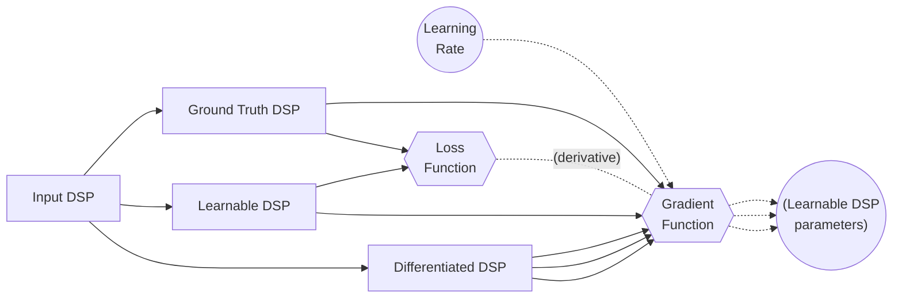
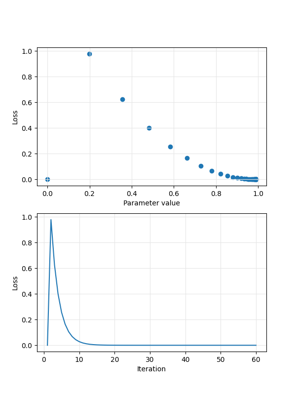

# Differentiable DSP in Faust

- [Introduction](#introduction)
- [Installation](#installation)
- [Compiling](#compiling-an-autodiff-example)
- [Running](#running-an-autodiff-example)
- [Verifying](#verification-via-finite-differences)

## Introduction

Using `[diff:on]` or `[diff:1]` parameter metadata, and the `-diff` flag to the Faust 
compiler, it is possible to create differentiable DSP algorithms.

Consider the following differentiable Faust algorithm, `gain.dsp`:

```faust
gain = hslider("gain [diff:1]", .5, 0, 1, .001);

process = _*(gain);
```

which can be represented mathematically as $y = gx$, where $y$ is the output signal,
$x$ the input signal, and $g$ the value of the gain parameter.

Compiling this algorithm with `faust gain.dsp` produces a `compute` method of the 
following form:

```c++
virtual void compute(int count, FAUSTFLOAT** RESTRICT inputs, FAUSTFLOAT** RESTRICT outputs) {
        FAUSTFLOAT* input0 = inputs[0];
        FAUSTFLOAT* output0 = outputs[0];
        float fSlow0 = float(fHslider0);
        for (int i0 = 0; i0 < count; i0 = i0 + 1) {
                output0[i0] = FAUSTFLOAT(fSlow0 * float(input0[i0]));
        }
}
```

The algorithm can be differentiated with respect to its parameter, `gain`, by calling
the Faust compiler with the `-diff` flag:

```shell
faust -diff gain.dsp
```

The result is a new DSP algorithm whose output is the derivative of the original algorithm
with respect to `gain`. In the case of this simple example, the compiler applies the product
rule:

$$
\begin{align*}
\frac{dy}{dg} &= v\frac{du}{dx} + u\frac{dv}{dx}, \quad u = g, v = x \\
              &= x\frac{d}{dg}(g) + g\frac{d}{dg}(x) \\
              &= x(1) + g(0) \\
              &= x
\end{align*}
$$

This is the resulting `compute` method:

```c++
virtual void compute(int count, FAUSTFLOAT** RE&=STRICT inputs, FAUSTFLOAT** RESTRICT outputs) {
        FAUSTFLOAT* input0 = inputs[0];
        FAUSTFLOAT* output0 = outputs[0];
        for (int i0 = 0; i0 < count; i0 = i0 + &=1) {
                output0[i0] = FAUSTFLOAT(float(input0[i0]));
        }
}
```

The Faust compiler generates this output by performing _automatic differentiation_ 
(_forward_, or _tangent_ mode autodiff, to be precise) as a signal stage
transformation of the input DSP algorithm.

For algorithms with multiple differentiable parameters, i.e. a vector of parameters 
$\mathbf{p}$, the differentiated DSP instance possesses a number of output channels 
equal to the number of parameters, each output representing an element in a vector of 
partial derivatives:

$$
\frac{\partial y}{\partial \mathbf{p}} = \begin{bmatrix}
    \frac{\partial y}{\partial p_1}
    \frac{\partial y}{\partial p_2}
    \cdots
    \frac{\partial y}{\partial p_N}
\end{bmatrix}^T
$$

### Motivation

Differentiable DSP algorithms lend themselves to applications reliant on _gradient descent_, 
such as machine learning.
A common audio machine learning problem is that of parameter optimisation; the architecture
file [autodiff.cpp](./autodiff.cpp) is designed to handle basic parameter optimisation
problems.

An output signal, $s_o(\mathbf{p}\_k)$, produced by a DSP algorithm with a vector of 
_learnable parameters_, is compared, by way of a **loss function**, $\mathcal{L}$, with 
that of a _ground truth_ output signal, $s_o(\mathbf{\hat{p}})$, governed by 
_hidden parameters_. 
A **gradient function** uses the partial derivatives, $\nabla s_o(\mathbf{p}\_k)$, produced 
by the differentiated DSP algorithm to compute 
$\frac{\partial \mathcal{L}}{\partial \mathbf{p}\_k}$, the derivative of the loss function 
with respect to the vector of parameters; for each parameter, the function produces a 
_gradient_, $\frac{\partial \mathcal{L}}{\partial p\_{i,k}}$, which, scaled by a 
_learning rate_, $\alpha$, is used to produce an updated parameter value, thus:
$$
\mathbf{p}\_{k+1} = \mathbf{p}\_k - \alpha\frac{\partial \mathcal{L}}{\partial \mathbf{p}\_k}.
$$
This process is repeated iteratively with the aim of minimising the value returned by the   
loss function, i.e. until the learnable parameters approximate the hidden ones.



## Installation

The simplest way to work with differentiable DSP in Faust is to use the architecture file
[autodiff.cpp](./autodiff.cpp), which uses Faust's LLVM backend to compile
DSP files at runtime (see [Compiling an autodiff example](#compiling-an-autodiff-example)).

To work with the Faust compiler directly, e.g. `faust -diff differentiable.dsp` Faust must 
be compiled with inclusion of the dynamic Faust library. This is most easily (if not quickly) 
achieved by building Faust with all backends and targets:

```shell
cd ../../build
make BACKENDS=all.cmake TARGETS=all.cmake
sudo make install
```

## Compiling an autodiff example

Subject to future modifications to the Faust compiler, compiling and running
an autodiff example demands the following approach:

Copy required files from the Faust architecture directory to the output directory:

```shell
outputdir=~/tmp/faust-autodiff
autodiffdir=$(faust --archdir)/autodiff
mkdir -p $outputdir
cp $autodiffdir/autodiff.h \
  $autodiffdir/autodiff.cpp \
  $autodiffdir/dspFactoryOwner.h \
  $autodiffdir/plot.py \
  $outputdir
```

Compile the generated cpp file.
Autodiff architecture uses libfaust to dynamically compile Faust algorithms
at runtime, so `llvm-config` must be used to determine the appropriate
LLVM library to link to.

```shell
outputdir=~/tmp/faust-autodiff
cd $outputdir || exit
c++ -std=c++14 autodiff.cpp /usr/local/lib/libfaust.a \
  $(llvm-config --ldflags --libs all --system-libs) \
  -o autodiff_example
```

### Missing library `-lzstd`

For LLVM 16 on Mac OS X, your c++ compiler may not be able to find the
[zstd](https://facebook.github.io/zstd/) library.
The easiest remedy is to install it via homebrew:

```shell
brew install zstd
```

and adjust the call to `c++` as follows:

```shell
c++ -std=c++14 autodiff.cpp /usr/local/lib/libfaust.a \
  $(llvm-config --ldflags --libs all --system-libs) \
  -L/opt/local/lib \
  -o autodiff_example
```

## Running an autodiff example

Run the compiled executable, specifying the following dsp files:

- `--input` &mdash; the signal to run through the ground truth and
  differentiable dsp algorithms;
- `--gt` &mdash; the ground truth dsp;
- `--diff` &mdash; the differentiable dsp to be trained/optimised.

- it is also possible to specify the loss function to use via the optional
  `-lf|--lossfunction <function>` flag.
  Implemented loss functions are:
    - `l1` &mdash; L-1 norm;
    - `l2` (default) &mdash; L-2 norm.

- supply `-lr|--learningrate <rate>` to set a floating-point number to use 
  as the learning rate (if not provided, the default value is 0.1).

```shell
outputdir=~/tmp/faust-autodiff
cd $outputdir || exit
examplesdir=$(faust --archdir)/examples/autodiff
./autodiff_example --input $examplesdir/noise.dsp \
  --gt $examplesdir/gain/gt.dsp \
  --diff $examplesdir/gain/diff.dsp \
  -lf l2 \
  -lr 0.1
```

> The above commands are encapsulated in [autodiff.sh](autodiff.sh).
>
>```shell
>./autodiff.sh <example_name>
>```
>
>For a list of available examples, execute `./autodiff.sh` without any arguments.

Running the executable displays numerical output describing the gradient descent process:

```
./autodiff.sh one_zero
Learning rate: 0.1
Sensitivity: 1e-07
...
Learnable parameter: b1, value: 0.5

-----------------------------------------------------------------
 Iter   Ground truth      Learnable           Loss             b1
-----------------------------------------------------------------
    1  -0.9990000129  -0.9990000129      0.000e+00              -
    2  -1.9870100021  -1.4975000620   0.2396199852   0.5978040695
    3  -1.9850200415  -1.5936084986   0.1532029957   0.6759297848
    4  -1.9830299616  -1.6699019670   0.0980491415   0.7383674979
    5  -1.9810400009  -1.7304140329   0.0628133789   0.7882921696
    ...
```

Run `python3 plot.py` in the output directory to produce a plot of loss against parameter 
value and iteration, and parameter value against iteration (requires matplotlib).



## Tips

- Call the Faust compiler with your differentiable DSP algorithm 
  to see the differentiated `compute` method in your output .cpp file.

```shell
faust -diff -a $archdir/autodiff/autodiff.cpp \
  -o $outputdir/my_autodiff.cpp \
  $archdir/examples/autodiff/gain/diff.dsp
```

The generated `compute` method isn't used at runtime, but it may assist with 
verifying that your algorithm is being differentiated correctly.

- Additionally, provide the `-d|--details` flag to the Faust compiler to see 
  detailed output of the differentiation process.

E.g. for a differentiable gain slider:

```faust
process = _*(hslider("gain [diff:1]", .5, 0, 1, .001));
```

computation of the derivative is reported as follows:

```
>>> Differentiate wrt. hslider("gain [diff:1]",0.5f,0.0f,1.0f,0.001f)

	x: IN[0]	y: hslider("gain [diff:1]",0.5f,0.0f,1.0f,0.001f)	op: MUL

		UI element: hslider("gain [diff:1]",0.5f,0.0f,1.0f,0.001f)

		DERIVATIVE: 1.0f

		Input: IN[0]

		DERIVATIVE: 0.0f

	DERIVATIVE: 0.0f*hslider("gain [diff:1]",0.5f,0.0f,1.0f,0.001f)+IN[0]*1.0f
```

Since this algorithm, $y = gx$, is a product of the input signal and a gain value,
the product rule is employed:

$$
\begin{align*}
\frac{dy}{dg} &= x\frac{d}{dg}(g) + g\frac{d}{dg}(x) \\
&= x(1) + g(0) \\
&= x
\end{align*}
$$

## Verification via finite differences

The output of a differentiated DSP algorithm can be compared with a numerical 
derivative computed via finite differences.
This can be achieved with the `autodiffVerifier` utility, which takes a differentiable
DSP algorithm, and, for each parameter $p$, and a perturbation of that parameter
$\epsilon$, computes the delta between autodiffed output and finite difference output:

$$
\delta = \left|y'(p) - \frac{y(p + \epsilon) - y(p)}{\epsilon}\right|
$$

To build the verifier, copy the required files and compile `autodiffVerifier.cpp`:

```shell
outputdir=~/tmp/faust-autodiff
autodiffdir=$(faust --archdir)/autodiff
mkdir -p $outputdir
cp $autodiffdir/autodiffVerifier.h \
  $autodiffdir/autodiffVerifier.cpp \
  $autodiffdir/dspFactoryOwner.h \
  $outputdir
cd $outputdir || exit
c++ -std=c++14 autodiffVerifier.cpp /usr/local/lib/libfaust.a \
  $(llvm-config --ldflags --libs all --system-libs) \
  -o verify
```

Then run the resulting executable, specifying input and differentiable DSP files,
and an optional value for $\epsilon$ (default 1e-3).

```shell
outputdir=~/tmp/faust-autodiff
cd $outputdir || exit
examplesdir=$(faust --archdir)/examples/autodiff
./verify --input $examplesdir/noise.dsp \
  --diff $examplesdir/gain/diff.dsp \
  --epsilon 1e-3
```

The differentiable DSP algorithm is compiled in (at least) three forms:
- unmodified: $y(\mathbf{p})$
- with $\epsilon$ applied to each adjustable parameter in turn
  - for multiple parameters, as many copies are made of the DSP as there are
    parameters, each copy having one parameter increased by $\epsilon$
  - for the $k^\text{th}$ parameter: $y(\dots,p_k + \epsilon,\dots)$
- automatically differentiated: $y'(\mathbf{p})$

These are used to compute $\delta$ for each parameter.
Additionally, each delta is compared with its corresponding channel in the 
autodiff algorithm (which represents a partial derivative with respect to that 
parameter), and relative error reported.

```
--------------------------------------------------------------------------------
 Iter          Param       Autodiff    Finite diff        |delta|     Rel. error
--------------------------------------------------------------------------------
    1             dc   1.0000000000   0.9999870658      1.293e-05        0.001 %
                gain   0.0000057486   0.0000298023      2.405e-05      418.428 %
    2             dc   1.0000000000   0.9999870658      1.293e-05        0.001 %
                gain  -0.3448459506  -0.3448426425      3.308e-06        0.001 %
    3             dc   1.0000000000   0.9999870658      1.293e-05        0.001 %
                gain  -0.6951856613  -0.6951763630      9.298e-06        0.001 %
...
   98             dc   1.0000000000   0.9999870658      1.293e-05        0.001 %
                gain  -0.5611450076  -0.5611385703      6.437e-06        0.001 %
   99             dc   1.0000000000   0.9999274611      7.254e-05        0.007 %
                gain   0.8623053432   0.8622407317      6.461e-05        0.007 %
  100             dc   1.0000000000   0.9999870658      1.293e-05        0.001 %
                gain  -0.5016716123  -0.5016651750      6.437e-06        0.001 %

Parameter: dc
===============================
         Mean delta:  1.989e-05
 Standard deviation:  1.679e-05

Parameter: gain
===============================
         Mean delta:  1.228e-05
 Standard deviation:  1.216e-05
```

Note that the high relative error for `gain` at iteration 1 is due to the very low 
amplitude of the first sample produced by Faust's `no.noise` function.

# Outlook

Algorithms are differentiated symbolically.
This may be OK for simple algorithms, but _expression swell_ is a risk for more involved
DSP implementations.
A true automatic differentiation implementation may be required if the symbolic
approach proves unwieldy.

Currently, loss and gradient descent are calculated on a per-sample basis.
This is fine for a gain control acting on deterministic noise input, but more
sophisticated approaches will be required to tackle problems involving
non-deterministic input, or frequency-domain loss.
