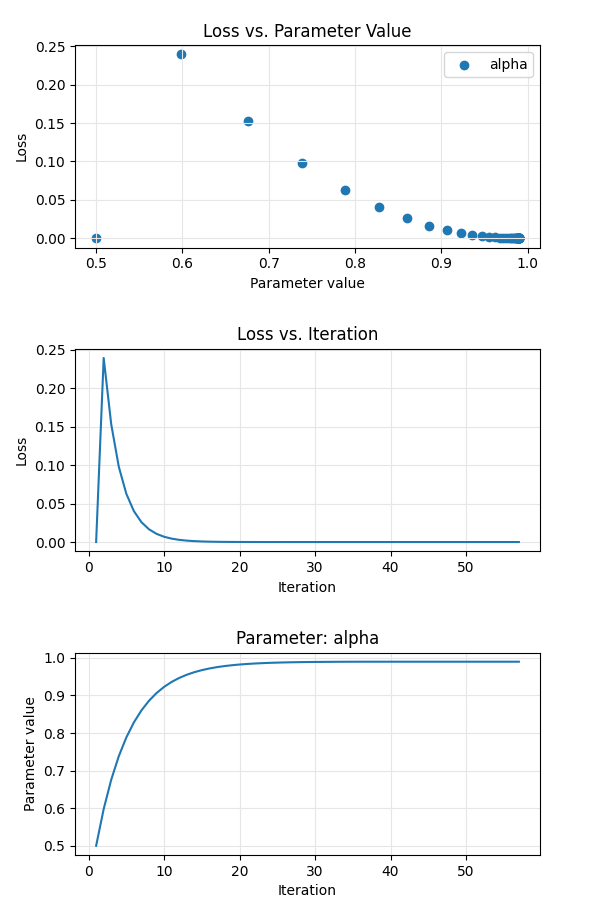

# Differentiable DSP in Faust

- [Introduction](#introduction)
  - [Motivation](#motivation)
  - [Differentiable Faust programs](#differentiable-faust-programs)
  - [Gradient descent in autodiff.cpp](#gradient-descent-in-the-autodiff-architecture-file)
- [Faust Installation](#faust-installation)
- [Compiling an autodiff example](#compiling-an-autodiff-example)
- [Running an autodiff example](#running-an-autodiff-example)
- [Verifying via finite differences](#verification-via-finite-differences)
- [Status of derivative implementations](#status-of-derivative-implementations)
- [Outlook](#outlook)

## Introduction

### Motivation

With increasing interest in machine learning, differentiable programming, a key
component in implementations of _gradient descent_, has become a hot topic in recent years.
Python libraries such as PyTorch and JAX provide APIs for automatic differentiation of
primitive functions, and the Swift language has introduced (limited) support for
autodiff as a first-class language feature (see Swift's [differentiable programming
manifesto](https://github.com/apple/swift/blob/main/docs/DifferentiableProgramming.md)).

In the audio domain, pioneering work in differentiable DSP by Google's Magenta team
([magenta/ddsp](https://github.com/magenta/ddsp)) demonstrated timbre transfer via gradient descent, based on 
differentiable implementations of functions supporting an array of audio synthesis and 
signal processing routines.
More generic differentiable DSP has been demonstrated by 
[jaxdsp](https://github.com/khiner/jaxdsp/), and, with specific applicability to Faust, 
David Braun's [DawDreamer](https://github.com/DBraun/DawDreamer) project transpiles 
Faust code to Python to take advantage of the autodiff functionality provided by JAX.

Faust, as an audio DSL, presents an interesting opportunity to implement native
differentiable programming for audio-specific applications.
Implemented effectively in the Faust compiler, differentiable DSP could benefit all available 
backends, and differentiable Faust algorithms could thus be deployed on all possible targets, 
from FPGA to the web.
The `autodiff` architecture files, and associated modifications to the Faust compiler,
facilitate this implementation and support parameter optimisation problems based on
automatic differentiation and gradient descent.

### Differentiable Faust programs

Using `[diff:on]` or `[diff:1]` parameter metadata, and the `-diff` flag to the Faust 
compiler, it is possible to create differentiable DSP algorithms.
`diff` metadata indicates a parameter with respect to which differentiation should be 
carried out, and can be applied to `hslider`, `vslider`, `nentry`, `button`, and `checkbox`
UI elements.

Forward mode autodiff is carried out as a signal stage transformation in the 
`SignalAutoDifferentiate` class (see [sigpromotion.cpp](../../compiler/transform/sigPromotion.cpp)), with derivative expressions 
for math.h equivalent primitives added in their respective [classes](../../compiler/extended).
With the exception of the recursive operator `~`, derivatives for all of Faust's basic and
C-equivalent primitives are defined. See [below](#status-of-derivative-implementations)
for an overview of the status of derivative implementations.

---

Consider the following differentiable Faust algorithm, `gain.dsp`:

```faust
gain = hslider("gain [diff:1]", .5, 0, 1, .001);

process = _*(gain);
```

which can be represented mathematically as $y = gx$, where $y$ is the output signal,
$x$ the input signal, and $g$ the value of the gain parameter.

Compiling this algorithm with `faust gain.dsp` produces a `compute` method of the 
following form:

```c++
virtual void compute(int count, FAUSTFLOAT** RESTRICT inputs, FAUSTFLOAT** RESTRICT outputs) {
    FAUSTFLOAT* input0 = inputs[0];
    FAUSTFLOAT* output0 = outputs[0];
    float fSlow0 = float(fHslider0);
    for (int i0 = 0; i0 < count; i0 = i0 + 1) {
            output0[i0] = FAUSTFLOAT(fSlow0 * float(input0[i0]));
    }
}
```

The algorithm can be differentiated with respect to its parameter, `gain`, by calling
the Faust compiler with the `-diff` flag:

```shell
faust -diff gain.dsp
```

The result is a new DSP algorithm whose output is the derivative of the original algorithm
with respect to `gain`. In the case of this simple example, the compiler applies the product
rule:

$$
\begin{align*}
\frac{dy}{dg} &= v\frac{du}{dx} + u\frac{dv}{dx}, \quad u = g, v = x \\
              &= x\frac{d}{dg}(g) + g\frac{d}{dg}(x) \\
              &= x(1) + g(0) \\
              &= x.
\end{align*}
$$

This is the resulting `compute` method:

```c++
virtual void compute(int count, FAUSTFLOAT** RE&=STRICT inputs, FAUSTFLOAT** RESTRICT outputs) {
    FAUSTFLOAT* input0 = inputs[0];
    FAUSTFLOAT* output0 = outputs[0];
    for (int i0 = 0; i0 < count; i0 = i0 + &=1) {
            output0[i0] = FAUSTFLOAT(float(input0[i0]));
    }
}
```

The Faust compiler generates this output by performing _automatic differentiation_
(_forward_, or _tangent_ mode **autodiff**, to be precise) as a signal stage
transformation of the input DSP algorithm.

Provide the `-d|--details` flag to the Faust compiler to see detailed output of the
differentiation process.

E.g. for a differentiable gain slider, computation of the derivative is reported as follows:

```
$ faust -d -diff gain.dsp
process = _,hslider("gain [diff:1]", 0.5f, 0.0f, 1.0f, 0.001f) : *;
...
>>> Differentiate wrt. hslider("gain [diff:1]",0.5f,0.0f,1.0f,0.001f)

	x: IN[0]	y: hslider("gain [diff:1]",0.5f,0.0f,1.0f,0.001f)	op: MUL

		UI element: hslider("gain [diff:1]",0.5f,0.0f,1.0f,0.001f)

		DERIVATIVE: 1.0f

		Input: IN[0]

		DERIVATIVE: 0.0f

	DERIVATIVE: 0.0f*hslider("gain [diff:1]",0.5f,0.0f,1.0f,0.001f)+IN[0]*1.0f
...
```

For algorithms with multiple differentiable parameters, i.e. a vector of parameters 
$\mathbf{p}$, the differentiated DSP instance possesses a number of output channels 
equal to the number of parameters, each output representing an element in a vector of 
partial derivatives:

$$
\frac{\partial y}{\partial \mathbf{p}} = \begin{bmatrix}
    \frac{\partial y}{\partial p_1}
    \frac{\partial y}{\partial p_2}
    \cdots
    \frac{\partial y}{\partial p_N}
\end{bmatrix}^T
$$

For example, given an algorithm consisting of a differentiable gain control and DC offset,
$y = p\_{\text{gain}}x + p\_{\text{dc}}$:

```faust
gain = hslider("gain [diff:1]", .5, 0, 1, .001);
dc = hslider("dc [diff:1]", .25, -.5, .5, .001);

process = _*gain,dc : +;
```

the resulting `compute` method is:

```c++
virtual void compute(int count, FAUSTFLOAT** RESTRICT inputs, FAUSTFLOAT** RESTRICT outputs) {
    FAUSTFLOAT* input0 = inputs[0];
    FAUSTFLOAT* output0 = outputs[0];
    FAUSTFLOAT* output1 = outputs[1];
    for (int i0 = 0; i0 < count; i0 = i0 + 1) {
        output0[i0] = FAUSTFLOAT(1.0f);
        output1[i0] = FAUSTFLOAT(float(input0[i0]));
    }
}
```

The first output channel represents the partial derivative with respect to the `dc`
parameter:

$$
\frac{\partial y}{\partial p_{\text{dc}}} = 1.
$$

The second output channel is the partial derivative with respect to `gain`:

$$
\frac{\partial y}{\partial p_{\text{gain}}} = x.
$$

### Gradient descent in the autodiff architecture file

Gradient descent is implemented in the architecture file, [autodiff.cpp](./autodiff.cpp).
Input, ground truth, learnable and differentiated DSP instances are compiled dynamically
at runtime and a `dsp_paralellizer` instance used to compute their output in parallel 
(see [Compiling an autodiff example](#compiling-an-autodiff-example)).

An output signal, $s_o(\mathbf{p}\_k)$, produced by a DSP algorithm with a vector of 
_learnable parameters_, $\mathbf{p}$ (at iteration $k$), is compared, by way of a 
**loss function**, $\mathcal{L}$, with that of a _ground truth_ output signal, 
$s_o(\mathbf{\hat{p}})$, governed by _hidden parameters_ $\mathbf{\hat{p}}$. 
A **gradient function** uses the partial derivatives, $\nabla s_o(\mathbf{p}\_k)$, produced 
by the differentiated DSP algorithm to compute 
$\frac{\partial \mathcal{L}}{\partial \mathbf{p}\_k}$, the derivative of the loss function 
with respect to the vector of parameters; for each parameter, the function produces a 
_gradient_, $\frac{\partial \mathcal{L}}{\partial p\_{i,k}}$, which, scaled by a 
_learning rate_, $\alpha$, is used to produce an updated parameter value:

$$
\mathbf{p}_{k+1} = \mathbf{p}_k - \alpha\frac{\partial \mathcal{L}}{\partial \mathbf{p}_k}.
$$


This process is repeated iteratively with the aim of minimising the value returned by the   
loss function, i.e. until the learnable parameters approximate the hidden ones.

#### Caveats

- at present, support is only provided for provision of a single ground truth signal,
  i.e. there is no way to provide batches of training data. 
- loss is calculated in the time domain on a per-sample basis, so, for gradient descent
  to work, the input signal must be deterministic, and the same input signal is delivered 
  to each of the ground truth, learnable, and differentiated DSP instances.
- in order to operate sample-by-sample, the autodiff architecture file uses a dummy
  audio driver, with a buffer size of 1, in order to be able to make per-sample parameter
  updates.
  - at present, autodiff in Faust is an exploratory project, and not a platform for 
    generating sound in real time.

## Faust Installation

The autodiff architecture file and verifier use 
[libfaust](https://faustdoc.grame.fr/manual/embedding/#libfaust-with-llvm-backend-api)
and Faust's LLVM backend to compile DSP files dynamically at runtime.
To support this, Faust must be compiled with inclusion of the LLVM backend. 
This is most easily (if not quickly) achieved by building Faust with all backends and 
targets:

```shell
cd ../../build
make BACKENDS=all.cmake TARGETS=all.cmake
sudo make install
```

## Compiling an autodiff example

autodiff.cpp differs from other architecture files (and is not yet a _true_
Faust architecture file) in that, rather than being populated by the Faust compiler via the 
`-a` flag, it is intended to be compiled directly (or via the shell script 
[autodiff.sh](./autodiff.sh)).

To compile, `llvm-config` should be used to generate flags for the appropriate LLVM library
to link to.

```shell
outputdir=~/tmp/faust-autodiff
c++ -std=c++14 autodiff.cpp $(faust -libdir)/libfaust.a \
  $(llvm-config --ldflags --libs all --system-libs) \
  -o $outputdir/autodiff_example
```

### Missing library `-lzstd`

For LLVM 16 on Mac OS X, your c++ compiler may not be able to find the
[zstd](https://facebook.github.io/zstd/) library.
The easiest remedy is to install it via homebrew:

```shell
brew install zstd
```

and adjust the call to `c++` as follows:

```shell
c++ -std=c++14 autodiff.cpp $(faust -libdir)/libfaust.a \
  $(llvm-config --ldflags --libs all --system-libs) \
  -L/opt/local/lib \
  -o $outputdir/autodiff_example
```

## Running an autodiff example

Run the compiled executable, specifying the following dsp files:

- `--input` &mdash; the signal to run through the ground truth and
  differentiable dsp algorithms;
  - for differentiable algorithms with no input, any valid `.dsp` file will do; 
- `--gt` &mdash; the ground truth dsp;
- `--diff` &mdash; the differentiable dsp to be trained/optimised.

- it is also possible to specify the loss function to use via the optional
  `-lf|--lossfunction <function>` flag.
  Implemented loss functions are:
    - `l1` &mdash; L-1 norm;
    - `l2` (default) &mdash; L-2 norm.

- supply `-lr|--learningrate <rate>` to set a floating-point number to use 
  as the learning rate (if not provided, the default value, 0.1, is used).

```shell
outputdir=~/tmp/faust-autodiff
cd $outputdir || exit
examplesdir=$(faust --archdir)/examples/autodiff
./autodiff_example --input $examplesdir/noise.dsp \
  --gt $examplesdir/gain/gt.dsp \
  --diff $examplesdir/gain/diff.dsp \
  -lf l2 \
  -lr 0.1
```

> The above commands are encapsulated in [autodiff.sh](autodiff.sh).
>
>```shell
>./autodiff.sh <example_name>
>```
>
>For a list of available examples, execute `./autodiff.sh` without any arguments.

Running the executable displays numerical output describing the gradient descent process.
For the `one_zero` example:

```
Learning rate: 0.1
Sensitivity: 1e-07
...
Learnable parameter: b1, value: 0.5

-----------------------------------------------------------------
 Iter   Ground truth      Learnable           Loss             b1
-----------------------------------------------------------------
    1  -0.9990000129  -0.9990000129      0.000e+00              -
    2  -1.9870100021  -1.4975000620   0.2396199852   0.5978040695
    3  -1.9850200415  -1.5936084986   0.1532029957   0.6759297848
    4  -1.9830299616  -1.6699019670   0.0980491415   0.7383674979
    5  -1.9810400009  -1.7304140329   0.0628133789   0.7882921696
  ...
```

The executable generates a csv file containing the loss and parameter values at each 
iteration.
To plot this data, copy [plot.py](./plot.py) to your output directory and run
`python3 plot.py` (requires that matplotlib is installed globally).



## Verification via finite differences

The output of a differentiated DSP algorithm can be compared with a numerical 
derivative computed via finite differences.
This can be achieved with the `autodiffVerifier` utility, which takes a differentiable
DSP algorithm, and, for each parameter $p$, and a perturbation of that parameter
$\epsilon$, computes the delta between autodiffed output and finite difference output:

$$
\delta = \left|y'(p) - \frac{y(p + \epsilon) - y(p)}{\epsilon}\right|
$$

To build the verifier, copy the required files and compile `autodiffVerifier.cpp`:

```shell
outputdir=~/tmp/faust-autodiff
mkdir -p $outputdir
c++ -std=c++14 autodiffVerifier.cpp $(faust -libdir)/libfaust.a \
  $(llvm-config --ldflags --libs all --system-libs) \
  -o $outputdir/autodiff_verify
```

Then run the resulting executable, specifying input and differentiable DSP files,
and an optional value for $\epsilon$ (default 1e-3).

```shell
outputdir=~/tmp/faust-autodiff
cd $outputdir || exit
examplesdir=$(faust --archdir)/examples/autodiff
./autodiff_verify --input $examplesdir/noise.dsp \
  --diff $examplesdir/gain_dc/diff.dsp \
  --epsilon 1e-3
```

The differentiable DSP algorithm is compiled in (at least) three forms:
- unmodified: $y(\mathbf{p})$
- with $\epsilon$ applied to each adjustable parameter in turn
  - for multiple parameters, as many copies are made of the DSP as there are
    parameters, each copy having one parameter increased by $\epsilon$
  - for the $k^\text{th}$ parameter: $y(\dots,p_k + \epsilon,\dots)$
- automatically differentiated: $y'(\mathbf{p})$

These are used to compute $\delta$ for each parameter.
Additionally, each delta is compared with its corresponding channel in the 
autodiff algorithm (which represents a partial derivative with respect to that 
parameter), and relative error reported.

```
--------------------------------------------------------------------------------
 Iter          Param       Autodiff    Finite diff        |delta|     Rel. error
--------------------------------------------------------------------------------
    1             dc   1.0000000000   0.9999870658      1.293e-05        0.001 %
                gain   0.0000057486   0.0000298023      2.405e-05      418.428 %
    2             dc   1.0000000000   0.9999870658      1.293e-05        0.001 %
                gain  -0.3448459506  -0.3448426425      3.308e-06        0.001 %
    3             dc   1.0000000000   0.9999870658      1.293e-05        0.001 %
                gain  -0.6951856613  -0.6951763630      9.298e-06        0.001 %
...
   98             dc   1.0000000000   0.9999870658      1.293e-05        0.001 %
                gain  -0.5611450076  -0.5611385703      6.437e-06        0.001 %
   99             dc   1.0000000000   0.9999274611      7.254e-05        0.007 %
                gain   0.8623053432   0.8622407317      6.461e-05        0.007 %
  100             dc   1.0000000000   0.9999870658      1.293e-05        0.001 %
                gain  -0.5016716123  -0.5016651750      6.437e-06        0.001 %

Parameter: dc
===============================
         Mean delta:  1.989e-05
 Standard deviation:  1.679e-05

Parameter: gain
===============================
         Mean delta:  1.228e-05
 Standard deviation:  1.216e-05
```

Note that the high relative error for `gain` at iteration 1 is due to the very low 
amplitude of the first sample produced by Faust's `no.noise` function.

# Status of derivative implementations

### C-equivalent primitives

- [x] Arithmetical operations `+`, `-`, `*`, `/`, `^`, `%`
    - derivative of `f % g` ignores the case where $f = kg, k \in \mathbb{Z}$
      and pretends that the function is smooth
- [x] Bitwise operations `&`, `|`, `xor`, `<<`, `>>`
    - the piecewise derivatives of these functions are zero _almost_ everywhere, so their
      derivatives are defined as zero everywhere.
- [x] Logical comparisons `<`, `>`, `<=`, `>=`, `!=`
    - derivatives also defined as zero everywhere.

### math.h-equivalent primitives

- [x] All functions besides `atan2`
    - derivative of `abs(x)` is defined as zero at $x = 0$
    - derivatives of `acos(x)` and `asin(x)` are only defined over the domain 
      $x \in \mathbb{R} : -1 < x < 1$
    - derivative of `tan(x)` doesn't behave well for $x = (2n - 1)\pi/2, n \in \mathbb{Z}$
    - derivatives of `ceil` and `floor`, `rint`, `round` are defined as zero everywhere
    - `fmod` and `remainder` are defined like `f % g` above
    - `log(x)` and `log10(x)` don't behave well at $x = 0$
- [ ] `atan2`

### Other primitives and expressions
- [x] Time operators `mem`, `'`, `@`
  - the derivative of `@` is implemented as convolution with a differentiated square pulse
    of single sample duration; this narrow support, coupled with per-sample time domain loss,
    means that, if differentiating with respect to a dynamic delay, the derivative may fail
    to capture the dynamic behaviour, in which case gradient descent will fail.
- [ ] `rdtable`, `rwtable`
- [ ] `soundfile`, `waveform`
- [ ] `select2`, `select3`
- [ ] Foreign expressions
- [ ] Recursion `~`
  - see [Outlook](#recursion) for further discussion of the difficulty of implementing a 
    derivative of a recursive expression at the Faust compiler's signal stage.

# Outlook

### Autodiff modes

Algorithms are differentiated using forward mode autodiff only.
This is acceptable for algorithms with small numbers of differentiable parameters, but for
algorithms with many parameters this may be computationally unviable.
As the Faust Autodiff project moves beyond an exploratory stage, it will be important to
consider implementing reverse mode autodiff too.

### Loss computation

Currently, loss and gradient descent are calculated in the time domain on a per-sample 
basis.
This works for simple parameter optimisation problems such as a learnable gain control 
acting on deterministic input, but more demanding problems will require the 
development of better measures of loss.
`magenta/ddsp` describes spectral loss as the [_bread and butter of comparing two audio 
signals_](https://github.com/magenta/ddsp/blob/7e0a39420f3bd87d9efd54cf0d36f4e258311340/ddsp/losses.py#L132);
it will be an important step to implement frequency-domain loss functions to support
sophisticated machine learning approaches in Faust.

### Recursion

A simple recursive DSP algorithm $y[n]$, dependent on continuous parameter $p$, may be
expressed as a composition of $f(u\_1, u\_2, u\_3)$, the non-recursive component, and 
$g(v\_1, v\_2)$, the recursive component:

$$
y(p)[n] = f(p, x[n], g(p, y(p)[n-1])).
$$

Its derivative with respect to $p$ is:

$$
\frac{d}{dp}y(p)[n] = \frac{\partial}{\partial u_1}f + \frac{\partial}{\partial u_3}f\left(
    \frac{\partial}{\partial v_1}g + 
    \frac{\partial}{\partial v_2}g\frac{\partial}{\partial p}y(p)[n-1] 
\right).
$$

Due to the way that recursion is expressed symbolically at the signal stage, however, it
is not straightforward to separate the elements of the body of the recursion in order to 
calculate the required partial derivatives.
Consequently, a derivative of recursion has not yet been implemented, which is of course a
significant drawback, given the ubiquity of recursive algorithms in signal processing and 
audio synthesis.

Decomposition of the body of a recursive expression may be possible at the **box stage**,
however; further work on this project should focus on establishing whether this is indeed
the case.

An additional potential advantage of moving autodiff to the box stage is that differentiation
could become a part of Faust's core syntax and box algebra.

### Putting autodiff to practical use

As described, gradient descent is carried out on a per-sample basis, which is only possible
with a buffer size of 1 sample, facilitated by the use of a dummy audio driver.
This means gradient descent, in its current implementation is of illustrative, but limited 
practical use.
Coupled with more sophisticated measures of loss, computed for windowed chunks of output
produced by the learnable algorithm, it should be possible (and indeed an important aim for
further development of this work) to use a real audio driver and optimise parameters in real
time.
