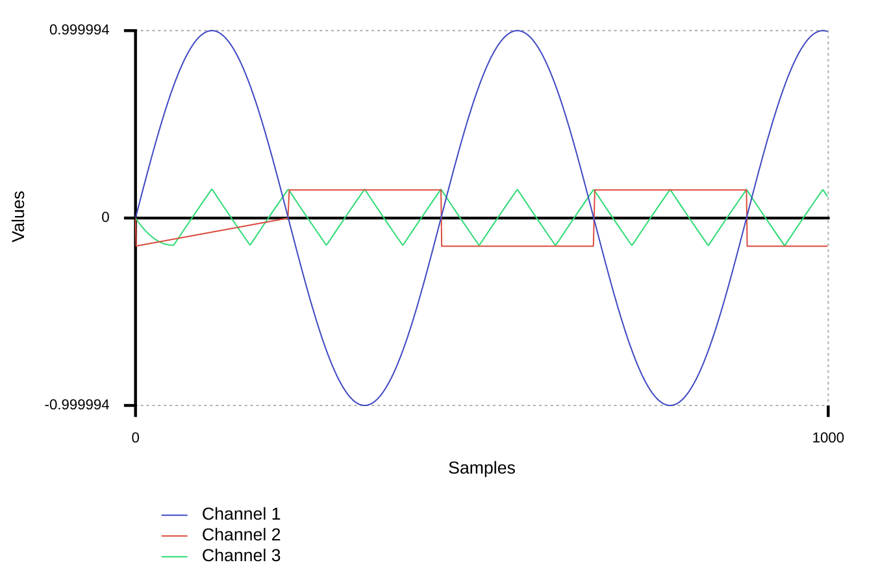
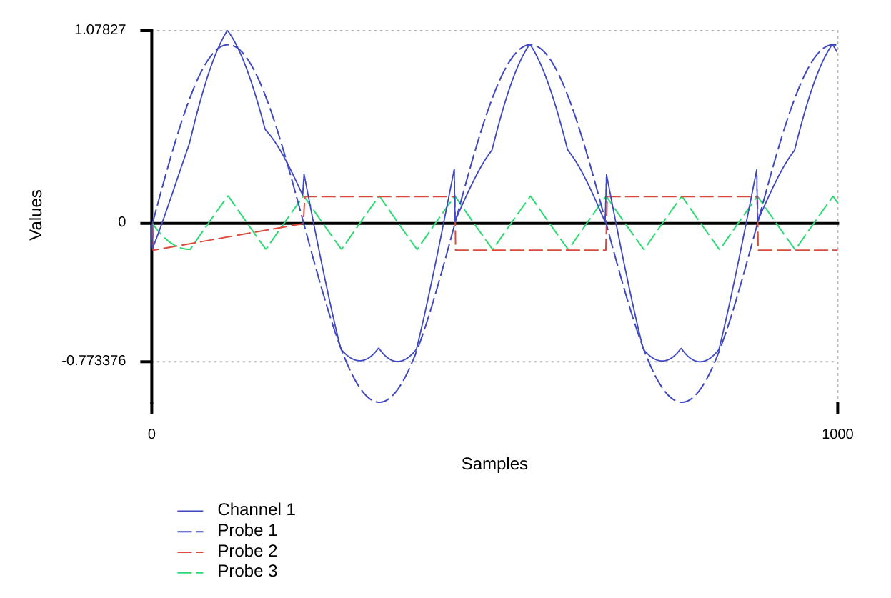
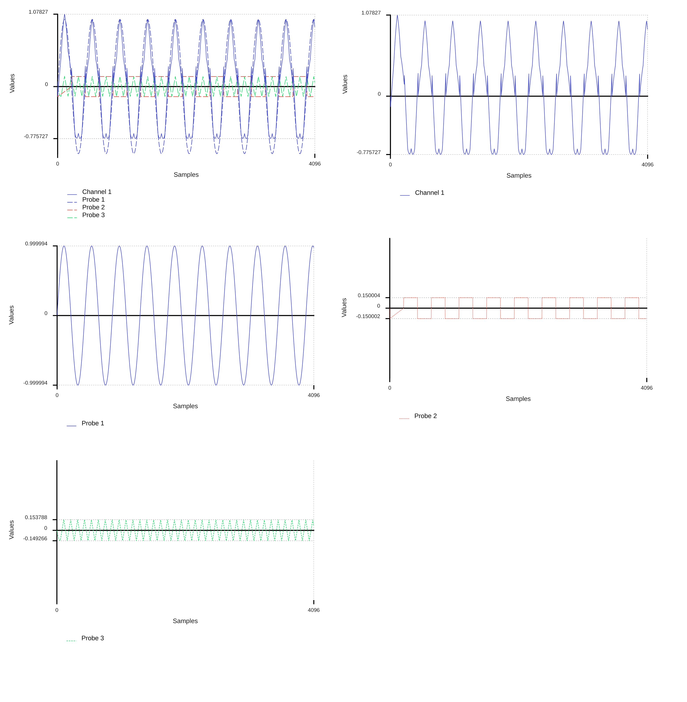

# faust2svgplot

## A tool to create svg of HTML files of plotted values.

### Usage
```
./faust2svgplot <options> <file.dsp> 
./file -n (nb_samples)[default:4096]> -bs (buffer_size)[default:1]> -r (sample_rate)[default:44100]> -s (start_at_sample)[default:0]> -sp (split)[default:0]>
```
### Basic example 

Here is a DSP code example:
 
```
import("stdfaust.lib");
process = 
(
    (
        os.osc(100),
        os.square(100)*0.15,
        os.triangle(400)*0.15
    )
);
```



#### Notes
* in usage, insert in <file.dsp> your favourite Faust dsp file

### The probe metadata 

You can use the `probe` metadata in bargraph in order to plot specific signals in the program. Here is a DSP code example:

```cpp
import("stdfaust.lib");

sendtoOut(n) = vbargraph("[probe:%n]label%n",0,1);

process = 
(
    (
        ((os.osc(100) : sendtoOut(1)),
        (os.square(100)*0.15 : sendtoOut(2)),
        (os.triangle(400)*0.15 : sendtoOut(3)))
        :>_
    )
);
```



### The split option
You can split your graph in multiples graph.svg for every probe and every channel.
* usage: `./file -sp 1`



#### Notes
* the probes are evaluated at every buffer size end. 
If you want the maximum precision, you will need to have a buffer size of 1 sample (set to 1 by default).
