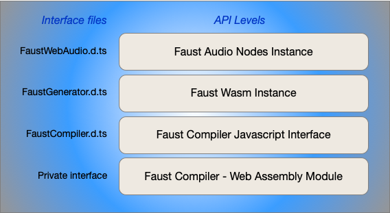

# Faust Web Audio Library

The Faust Web Audio library provides a high level Javascript API over the [Faust](https://faust.grame.fr) compiler. The interface is designed to be used with [TypeScript](https://www.typescriptlang.org/), but describes and documents the API for pure Javascript as well. This document provides an overview of the differents levels of the API. Examples of use are also provided in the `exemples`folder.

## Organisation of the API

The API is organised from low to high level as illustrated by the figure below.

### Faust Compiler Web Assembly module

The first level is the faust compiler compiled as a wasm library named `libfaust-wasm`.
It consists in 3 different files:

- libfaust-wasm.wasm : the faust compiler provided as a Web Assembly module 
- libfaust-wasm.js : a javascript loader of the Web Assembly module
- libfaust-wasm.data : a virtual file system containing the Faust libraries.

You must include `libfaust-wasm.js` in your html page. The loader will take care of providing an instance of the Faust Web assembly module and of the associated virtual file system (libfaust-wasm.data). Note that depending on the relative location of `libfaust-wasm.js`, the loader may fail to find  `libfaust-wasm.data`; in this case, the simple solution consists in copying  `libfaust-wasm.data` aside the refering web page.

### Faust Compiler Javascript Interface

The Faust Compiler Javascript interface is described in `FaustCompiler.d.ts`.   
It provides *classic* Faust compilation services, which output is a raw Web Assembly module with an associated JSON description of the module.

### Faust Wasm Instance

This level takes a Web Assembly module produced by the Faust compiler and build an memory instance of this module, ready to run, but not yet connected to any audio node.  
It is described in `FaustGenerator.d.ts`.   

### Faust Audio Nodes Instances

This level takes a Faust Wasm instance to build an audio node. [AudioWorklet](https://developer.mozilla.org/fr/docs/Web/API/AudioWorklet) and [ScriptProcessor](https://developer.mozilla.org/en-US/docs/Web/API/ScriptProcessorNode) nodes are supported.  
Note that ScriptProcessor is marked as deprecated but it's the only audio architecture available on Safari.

## Misc. services

- FaustUtilities.d.ts : provides facilities to browse Faust generated SVG diagrams
- FaustWAP.d.ts : provides [Web Audio Plugins](https://hal.univ-cotedazur.fr/hal-01893660/document) API support.

----

